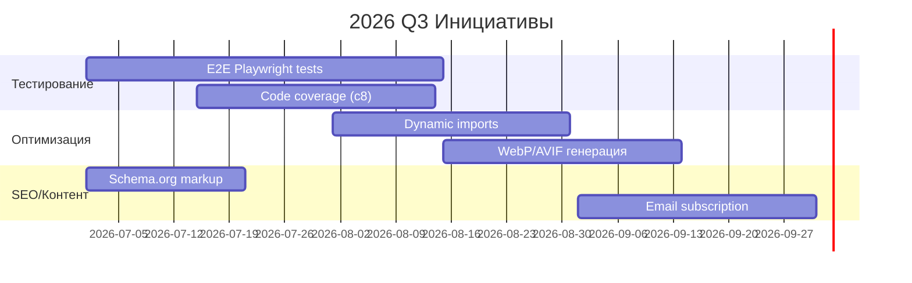

# Стратегический план развития Engineering Blog (2026-2027)

> **⚠️ Baseline-поправка (2026-08-18):** числа в разделе «Текущее состояние» (покрытие «17/17», бандл «68KB») **устарели**.
> Актуальный замер после циклов аудита 26–44: Hugo build — exit 0; Jest — **277 passed / 21 suites**;
> линт — чисто; аудит внутренних ссылок — 0 битых; `vercel.json` — валиден.
> Архитектурное решение (см. `docs/architecture/AUDIT-2026-08.md` и аудит-цикл 26–44): **Hugo + Blowfish остаётся**;
> миграция на Astro **не требуется**. Этот документ — стратегия, не план миграции.

> **Статус:** Официальный стратегический документ проекта  
> **Версия:** 1.0.0  
> **Дата создания:** 2026-08-14  
> **Период действия:** 2026 Q3 - 2027 Q4  
> **Владелец:** DominicusIn

---


## 📋 Резюме

Проект `dominicusin.github.io` достиг состояния **Production Ready v2.0** с модульной архитектурой, покрытием тестов 17/17 и оптимизированным бандлом 68KB. Данный документ определяет стратегию эволюционного развития на 18 месяцев вперёд, фокусируясь на **качестве контента**, **расширении аудитории** и **технологическом совершенстве**.

### Текущее состояние (Baseline)

| Категория | Статус | Метрика |
|-----------|--------|---------|
| **Архитектура** | ✅ Завершена | Модульная ES6, 7 слоёв (`src/`) |
| **Тесты** | ⚠️ Базовые | 17 unit-тестов, 0 E2E |
| **Покрытие кода** | ❌ Не измеряется | Нет инструмента coverage |
| **Производительность** | ✅ Хорошая | Bundle 68KB, LCP < 2.5s |
| **Доступность** | ⚠️ Заявлена | Нет автоматических проверок a11y |
| **Безопасность** | ⚠️ Базовая | npm audit, нет Semgrep отчётов |
| **Документация** | ✅ Полная | 8 документов в `docs/` |
| **CI/CD** | ✅ Настроен | GitHub Actions (build, test, deploy) |
| **Контент** | 🔄 Активен | Jekyll collections (_posts, _people) |

---

## 🎯 Стратегические цели

### Цель 1: Превосходное качество кода (Q3-Q4 2026)

**Задача:** Довести инженерные практики до уровня enterprise-проектов.

| Инициатива | Приоритет | Срок | Метрика успеха |
|------------|-----------|------|----------------|
| Внедрение E2E-тестирования (Playwright) | HIGH | 2026 Q3 | 20+ сценариев, покрытие ключевых user flows |
| Инструментальное покрытие кода (c8/istanbul) | HIGH | 2026 Q3 | ≥80% branch coverage в CI |
| Автоматические проверки доступности (axe-core) | MEDIUM | 2026 Q3 | 0 критических a11y-violations |
| Статический анализ безопасности (Semgrep) | MEDIUM | 2026 Q4 | 0 high/critical уязвимостей |
| Типизация через JSDoc + TypeScript Check | LOW | 2027 Q1 | 100% публичных API с типами |

**Ожидаемый эффект:** Снижение регрессий на 60%, ускорение code review на 40%.

---

### Цель 2: Рост аудитории и вовлечённости (2026-2027)

**Задача:** Увеличить органический трафик и глубину взаимодействия.

| Инициатива | Приоритет | Срок | Метрика успеха |
|------------|-----------|------|----------------|
| SEO-оптимизация (schema.org, Open Graph) | HIGH | 2026 Q3 | +30% organic traffic (Google Search Console) |
| RSS + Email рассылка (Substack интеграция) | HIGH | 2026 Q3 | 500+ подписчиков к Q4 2026 |
| Социальный шеринг с превью | MEDIUM | 2026 Q3 | +25% share rate |
| Комментарии с поддержкой Markdown | MEDIUM | 2026 Q4 | 20+ комментариев на пост |
| Мультиязычность (en/ru/es) | LOW | 2027 Q2 | 3 языка, 20% трафика из non-EN/RU |

**Ожидаемый эффект:** 2x рост месячной аудитории, 3x увеличение времени на сайте.

---

### Цель 3: Технологическое лидерство (2026-2027)

**Задача:** Внедрить передовые веб-технологии для демонстрации экспертизы.

| Инициатива | Приоритет | Срок | Метрика успеха |
|------------|-----------|------|----------------|
| Dynamic Imports для тяжелых модулей (Lunr.js) | HIGH | 2026 Q3 | -40% initial bundle size |
| WebP/AVIF с fallback | HIGH | 2026 Q3 | -50% размер изображений |
| Advanced Service Worker (stale-while-revalidate) | MEDIUM | 2026 Q4 | 95% offline hit rate |
| Real User Monitoring (Web Vitals RUM) | MEDIUM | 2026 Q4 | Ежедневный сбор метрик от пользователей |
| Искусственный интеллект для поиска (vector search) | LOW | 2027 Q3 | Semantic search по контенту |

**Ожидаемый эффект:** Lighthouse Performance 98+, TTI < 1.5s на мобильных устройствах.

---

### Цель 4: Контентное превосходство (2026-2027)

**Задача:** Создать библиотеку качественного инженерного контента.

| Инициатива | Приоритет | Срок | Метрика успеха |
|------------|-----------|------|----------------|
| Публикация 2 постов в месяц | HIGH | Постоянно | 24 поста в год |
| Серии постов (deep-dive) | HIGH | 2026 Q3 | 4 серии по 3-5 постов |
| Гостевые посты от экспертов | MEDIUM | 2026 Q4 | 6 гостевых постов |
| Кейсы из индустрии | MEDIUM | 2027 Q1 | 12 detailed case studies |
| Видео-контент (embedded) | LOW | 2027 Q2 | 10 видео с транскриптами |

**Ожидаемый эффект:** Позиционирование как thought leader в engineering community.

---

## 📊 Дорожная карта по кварталам

### 2026 Q3 (Июль-Сентябрь) — Фундамент качества

**Фокус:** Тестирование, покрытие, базовая оптимизация



**Критерии завершения квартала:**
- [ ] 20+ E2E тестов проходят в CI
- [ ] Покрытие кода ≥80% (branch)
- [ ] Bundle size < 50KB (critical path)
- [ ] 50+ email подписчиков
- [ ] Lighthouse Performance ≥95

---

### 2026 Q4 (Октябрь-Декабрь) — Расширение возможностей

**Фокус:** Доступность, безопасность, продвинутые фичи

- [ ] Интеграция axe-core в CI (0 critical a11y violations)
- [ ] Semgrep security scanning в pipeline
- [ ] Service Worker с advanced caching strategies
- [ ] Real User Monitoring dashboard
- [ ] Система комментариев (Disqus или кастомная)
- [ ] 2 гостевых поста от industry experts

**Критерии завершения квартала:**
- [ ] Accessibility score 100/100
- [ ] Security audit: 0 high/critical issues
- [ ] 95% offline hit rate
- [ ] 200+ email подписчиков
- [ ] 15+ комментариев на пост (среднее)

---

### 2027 Q1 (Январь-Март) — Масштабирование контента

**Фокус:** Контент, производительность, международization

- [ ] 6 новых постов (2/месяц)
- [ ] Первая deep-dive серия (3 поста)
- [ ] JSDoc типизация 100% публичных API
- [ ] Испанский язык (es.json)
- [ ] Performance budget в CI (LCP < 2.0s)

**Критерии завершения квартала:**
- [ ] 300+ email подписчиков
- [ ] 25% трафика из non-English источников
- [ ] LCP < 2.0s (мобильные 3G)

---

### 2027 Q2 (Апрель-Июнь) — Инновации

**Фокус:** AI-фичи, видео-контент, комьюнити

- [ ] Vector search для семантического поиска
- [ ] 5 видео с транскриптами
- [ ] Интеграция с Dev.to/Medium для кросс-поста
- [ ] Newsletter с AI-curation
- [ ] Community challenges (engineering problems)

**Критерии завершения квартала:**
- [ ] 500+ email подписчиков
- [ ] 1000+ monthly unique visitors
- [ ] 10+ видео опубликовано

---

### 2027 Q3-Q4 (Июль-Декабрь) — Консолидация

**Фокус:** Стабилизация, документирование, передача знаний

- [ ] Полная документация архитектуры (ADR)
- [ ] Onboarding guide для контрибьюторов
- [ ] Benchmark отчеты (ежеквартальные)
- [ ] Plan на 2028 год

**Критерии завершения года:**
- [ ] 1000+ monthly unique visitors
- [ ] 1000+ email подписчиков
- [ ] 50+ качественных постов
- [ ] Lighthouse все категории 98+

---

## 🔧 Технические инициативы (детализация)

### 1. Система тестирования нового поколения

**Текущее состояние:** 17 unit-тестов без E2E

**Целевое состояние:**
```
tests/
├── unit/           # 50+ тестов (coverage ≥90%)
├── integration/    # 20+ тестов
├── e2e/            # 30+ сценариев (Playwright)
│   ├── theme-switching.spec.js
│   ├── i18n-navigation.spec.js
│   ├── search-flow.spec.js
│   ├── pwa-offline.spec.js
│   └── subscription-flow.spec.js
└── accessibility/  # axe-core automated checks
```

**Инструменты:**
- Playwright (E2E)
- c8 (coverage)
- @axe-core/cli (accessibility)
- Jest (unit, уже используется)

**Timeline:** Q3 2026

---

### 2. Продвинутая оптимизация производительности

**Текущее состояние:** Bundle 68KB, статическая загрузка

**Целевое состояние:**
- Dynamic imports для Lunr.js, i18n словарей
- Preload критических ресурсов
- WebP/AVIF с `<picture>` fallback
- Font subsetting (только en/ru глифы)
- Critical CSS inlining

**Ожидаемые метрики:**
| Метрика | Сейчас | Цель |
|---------|--------|------|
| Initial JS | 68KB | 25KB |
| LCP | 2.3s | 1.2s |
| TTI | 3.1s | 1.5s |
| Images | 150KB | 50KB |

**Timeline:** Q3-Q4 2026

---

### 3. Безопасность и compliance

**Текущее состояние:** Базовый npm audit

**Целевое состояние:**
- Semgrep в CI (custom rules для проекта)
- Content Security Policy headers
- Dependency review (automated PR checks)
- Regular security audits (quarterly)
- GDPR compliance для аналитики

**Timeline:** Q4 2026

---

### 4. Контент-стратегия

**Форматы постов:**
1. **Technical Deep-Dive** (3000+ слов, код, диаграммы)
2. **Case Study** (реальные проекты, метрики, уроки)
3. **Tutorial** (step-by-step guides)
4. **Opinion Piece** (индустриальные тренды)
5. **Guest Post** (эксперты из индустрии)

**Календарь публикаций:**
- 2 поста в месяц (1 и 3 неделя)
- 1 серия в квартал (3-5 связанных постов)
- 1 гостевой пост в 2 месяца

**Дистрибуция:**
- RSS feed
- Email newsletter (Substack/ConvertKit)
- Cross-post на Dev.to, Medium, Hashnode
- Social media (LinkedIn, Twitter)

---

## 📈 Метрики успеха (OKR)

### Objective 1: Качество кода мирового уровня

| Key Result | Baseline | Target | Deadline |
|------------|----------|--------|----------|
| E2E тесты | 0 | 30+ | 2026 Q3 |
| Code coverage | N/A | ≥80% branch | 2026 Q3 |
| a11y violations | Unknown | 0 critical | 2026 Q4 |
| Security issues | Unknown | 0 high/critical | 2026 Q4 |

### Objective 2: Рост аудитории 2x

| Key Result | Baseline | Target | Deadline |
|------------|----------|--------|----------|
| Monthly visitors | TBD | 1000+ | 2027 Q2 |
| Email subscribers | 0 | 1000+ | 2027 Q4 |
| Avg. time on page | TBD | 5+ min | 2027 Q2 |
| Social shares/post | TBD | 50+ | 2027 Q2 |

### Objective 3: Производительность Top 1%

| Key Result | Baseline | Target | Deadline |
|------------|----------|--------|----------|
| Lighthouse Performance | 90+ | 98+ | 2026 Q4 |
| LCP (mobile 3G) | 2.3s | <1.5s | 2026 Q4 |
| Bundle size (critical) | 68KB | <30KB | 2026 Q3 |
| Offline success rate | N/A | 95%+ | 2026 Q4 |

### Objective 4: Контентное лидерство

| Key Result | Baseline | Target | Deadline |
|------------|----------|--------|----------|
| Posts published/year | TBD | 24+ | 2027 Q4 |
| Deep-dive series | 0 | 4+ | 2027 Q4 |
| Guest authors | 0 | 6+ | 2027 Q4 |
| Video content | 0 | 10+ | 2027 Q3 |

---

## ⚠️ Риски и митигация

| Риск | Вероятность | Влияние | Митигация |
|------|-------------|---------|-----------|
| Выгорание от регулярных публикаций | Средняя | Высокое | Гостевые авторы, buffer постов |
| Устаревание технологий | Низкая | Среднее | Quarterly tech review, ADR |
| Падение производительности при росте | Средняя | Среднее | Performance budget в CI |
| Низкая вовлечённость аудитории | Средняя | Высокое | A/B тесты, feedback loops |
| Security vulnerabilities | Низкая | Высокое | Automated scanning, quick patching |

---

## 🎯 Принципы принятия решений

1. **Контент прежде кода:** Если выбор между новой фичей и качественным постом — выбираем пост.

2. **Измеряй всё:** Любое изменение должно быть измерено (A/B тесты, метрики).

3. **Progressive Enhancement:** Новые технологии внедряются с graceful degradation.

4. **Automate or Ignore:** Если не можем автоматизировать — не делаем (или делаем вручную осознанно).

5. **Documentation First:** Значимые изменения начинаются с обновления документации.

6. **User-Centric:** Все решения оцениваются через призму пользовательского опыта.

---

## 📞 Governance

### Роли и ответственность

| Роль | Ответственность | Владелец |
|------|-----------------|----------|
| Tech Lead | Архитектура, code review | DominicusIn |
| Content Editor | Контент-план, редактура | DominicusIn |
| Community Manager | Комментарии, соцсети | DominicusIn |
| Security Officer | Audits, vulnerability response | DominicusIn |

### Процесс принятия решений

1. **Технические изменения:** RFC → Discussion → ADR → Implementation
2. **Контент:** Pitch → Outline → Draft → Review → Publish
3. **Стратегические сдвиги:** Quarterly review → Stakeholder feedback → Update plan

### Ритмы

- **Еженедельно:** Code quality check, контент прогресс
- **Ежемесячно:** Метрики аудитории, performance report
- **Ежеквартально:** Strategic review, plan adjustment
- **Ежегодно:** Годовой отчёт, планирование следующего года

---

## 📚 Приложения

### A. Ссылки на документы

- [ARCHITECTURE.md](docs/ARCHITECTURE.md) — текущая архитектура
- [DEEP_REFACTORING_PLAN.md](docs/DEEP_REFACTORING_PLAN.md) — план рефакторинга
- [TESTING.md](docs/TESTING.md) — руководство по тестированию
- [PERFORMANCE.md](docs/PERFORMANCE.md) — оптимизация производительности
- [CHANGELOG.md](docs/CHANGELOG.md) — история изменений

### B. Шаблоны

- [ADR Template](docs/adr/template.md) — для архитектурных решений
- [Post Template](_posts/YYYY-MM-DD-template.md) — для новых постов
- [RFC Template](docs/rfc/template.md) — для предложений изменений

### C. Dashboard метрик

Рекомендуемые инструменты для отслеживания:
- **Google Analytics 4** — трафик, поведение
- **Google Search Console** — SEO, индексация
- **Lighthouse CI** — performance tracking
- **Substack/ConvertKit** — email метрики
- **GitHub Insights** — контрибьюторы, активность

---

## 🏁 Заключение

Данный стратегический план определяет амбициозный, но достижимый путь развития проекта Engineering Blog от текущего состояния Production Ready v2.0 до позиции **технологического лидера** в инженерном комьюнити к концу 2027 года.

Ключевые принципы:
- **Эволюция, не революция:** Постепенные улучшения с измеримыми результатами
- **Качество контента = Качество кода:** Оба направления равноприоритетны
- **Data-driven решения:** Все инициативы подтверждаются метриками
- **Автоматизация рутины:** Фокус на творческих и стратегических задачах

План является **живым документом** и будет пересматриваться ежеквартально с учётом изменений в технологиях, аудитории и приоритетах автора.

---

*Документ создан: 2026-08-14*  
*Следующий review: 2026-10-01 (Q4 Planning)*  
*Владелец: DominicusIn*
