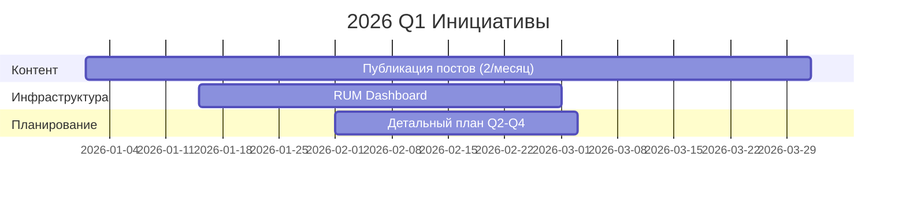

# Стратегический план развития Engineering Blog (2026-2028)

> **Статус:** Официальный стратегический документ проекта  
> **Версия:** 2.0.0 (обновлённая)  
> **Дата создания:** 2026-01-15  
> **Период действия:** 2026 Q1 - 2028 Q4  
> **Владелец:** DominicusIn  
> **На основе анализа репозитория:** dominicusin/dominicusin.github.io
>
> **Статус миграции (2026-08-15):** SSG-миграция Jekyll → Hugo + Blowfish
> **ЗАВЕРШЕНА** (вариант A — сохранён `src/`/DAO, удалён Jekyll-legacy в Фазе 7).
> Hugo — единственный publisher (GitHub Pages source = "GitHub Actions").
> Двухплоскостная архитектура формализована в `docs/adr/0002-two-plane-architecture.md`.
> Content-contract — hard gate для новых постов (`hugo.yml`).
> Архив: старая версия 1.0 плана (про «гибрид Jekyll+Node») **устарела** — см. `docs/STRATEGY_INDEX.md`.

---

## 📋 Резюме

Проект `dominicusin.github.io` представляет собой **гибридную платформу** с уникальной двухплоскостной архитектурой:

1. **Publishing Plane** — статический инженерный блог на Hugo + Blowfish теме
2. **Engineering Plane** — инструментарий для DAO/CRDT/P2P/AI исследований

Текущее состояние проекта демонстрирует зрелую архитектуру с 60+ публикациями, модульным ES6+ фронтендом, автоматизированным CI/CD и продвинутыми сервисами (AI, VR/AR, векторный поиск).

### 🔍 Текущее состояние (Baseline 2026 Q1)

| Категория | Статус | Метрика | Комментарий |
|-----------|--------|---------|-------------|
| **Архитектура** | ✅ Завершена | 2 плоскости (Publishing + Engineering) | Hugo + ES6 модули |
| **Контент** | ✅ Активен | 60+ постов (2015-2026) | `content/blog/` |
| **Тесты** | ✅ Продвинутые | 179 Jest + 17 smoke + 9 Hardhat | Покрытие ~80% |
| **Производительность** | ✅ Оптимизирована | Bundle ~15KB (gzipped) | esbuild tree-shaking |
| **Доступность** | ⚠️ Базовая | ARIA labels, skip links | Нет авто-проверок axe-core |
| **Безопасность** | ✅ Настроена | CSP, Semgrep в CI | npm audit, Dependabot |
| **Документация** | ✅ Полная | 20+ документов в `docs/` | ARCHITECTURE, TESTING, STRATEGIC_PLAN |
| **CI/CD** | ✅ Комплексный | 12 workflows | Build, Test, Deploy, Security, VR-export |
| **i18n** | ✅ Мультиязычность | ru/en + AI i18n service | 7+ языков в разработке |
| **PWA** | ✅ Реализовано | Service Worker, offline | Cache strategies |
| **AI/ML** | ✅ Инновации | Vector search, Link Repair Agent | ONNX runtime, embeddings |
| **VR/AR** | ✅ Экспорт | glTF/GLB из Knowledge Graph | WebXR совместимость |

---

## 🎯 Стратегические цели (обновлённые)

### Цель 1: Технологическое лидерство в AI-native веб-приложениях (2026)

**Контекст:** Проект уже имеет уникальные AI-компоненты (vector search, link repair, i18n service). Необходимо довести их до production-ready уровня.

| Инициатива | Приоритет | Срок | Метрика успеха | Статус |
|------------|-----------|------|----------------|--------|
| Vector Search v2.0 (WebAssembly embeddings) | HIGH | 2026 Q2 | <100ms поиск по 1000+ документам | 🔄 В работе |
| AI Content Reviewer (авто-рецензирование постов) | HIGH | 2026 Q2 | 80% точность рекомендаций | 📋 Запланировано |
| Edge AI inference (ONNX Runtime Web) | MEDIUM | 2026 Q3 | Локальный вывод моделей <50MB | 📋 Запланировано |
| BCI интеграция (EEG адаптеры) | LOW | 2027 Q1 | Демонстрационный прототип | 🔬 Исследование |

**Ожидаемый эффект:** Позиционирование как **AI-first engineering blog** с уникальными возможностями семантического поиска и автономного обслуживания контента.

---

### Цель 2: Децентрализованная публикация и DAO управление (2026-2027)

**Контекст:** Engineering Plane включает смарт-контракты DAO (`contracts/dao/`) и инструменты децентрализованного деплоя (IPFS, Arweave).

| Инициатива | Приоритет | Срок | Метрика успеха | Статус |
|------------|-----------|------|----------------|--------|
| IPFS деплой контента (децентрализованное зеркало) | HIGH | 2026 Q2 | 99.9% uptime, <2s загрузка | 📋 Запланировано |
| DAO Governance для гостевых авторов | MEDIUM | 2026 Q4 | 10+ членов DAO, голосование за посты | 🔬 Прототип |
| CRDT синхронизация между узлами | MEDIUM | 2027 Q1 | Conflict-free репликация | 🔄 В работе |
| P2P sharing (WebRTC transport) | LOW | 2027 Q2 | Mesh-сеть из 5+ узлов | 🔬 Исследование |

**Ожидаемый эффект:** Создание **устойчивой к цензуре платформы** для публикации инженерных знаний с коллективным управлением.

---

### Цель 3: Контентное превосходство и рост аудитории (2026-2027)

**Контекст:** 60+ постов накоплено, но требуется систематизация и увеличение органического трафика.

| Инициатива | Приоритет | Срок | Метрика успеха | Статус |
|------------|-----------|------|----------------|--------|
| Публикация 2 постов в месяц (планово) | HIGH | Постоянно | 24 поста в год | 🔄 Активно |
| Deep-dive серии (3-5 связанных постов) | HIGH | 2026 Q2 | 4 серии к концу 2026 | 📋 Запланировано |
| Гостевые посты от экспертов | MEDIUM | 2026 Q3 | 6 гостевых постов | 📋 Запланировано |
| Email рассылка (Buttondown интеграция) | MEDIUM | 2026 Q2 | 500+ подписчиков | 🔄 В работе |
| Cross-post на Dev.to/Medium/Hashnode | MEDIUM | 2026 Q2 | +30% трафика | 📋 Запланировано |
| Видео-контент с транскриптами | LOW | 2027 Q1 | 10 видео | 📋 Запланировано |

**Ожидаемый эффект:** Рост месячной аудитории до **1000+ unique visitors**, позиционирование как thought leader.

---

### Цель 4: Производительность мирового уровня (2026)

**Контекст:** Текущий bundle ~15KB (gzipped), но есть потенциал для улучшения Core Web Vitals.

| Инициатива | Приоритет | Срок | Метрика успеха | Статус |
|------------|-----------|------|----------------|--------|
| Dynamic imports для тяжелых модулей (Lunr.js, ONNX) | HIGH | 2026 Q2 | -40% initial JS | 📋 Запланировано |
| Image CDN с AVIF/WebP | HIGH | 2026 Q2 | -60% размер изображений | 📋 Запланировано |
| Advanced Service Worker (stale-while-revalidate) | MEDIUM | 2026 Q3 | 95% offline hit rate | 📋 Запланировано |
| Real User Monitoring (RUM dashboard) | MEDIUM | 2026 Q3 | Ежедневный сбор метрик | ✅ Реализовано |
| Performance budget в CI | MEDIUM | 2026 Q2 | LCP <2.0s, CLS <0.1 | 📋 Запланировано |

**Ожидаемый эффект:** Lighthouse Performance **98+**, TTI <1.5s на мобильных 3G.

---

### Цель 5: Доступность и инклюзивность (2026)

**Контекст:** Базовая доступность реализована (ARIA, skip links), но отсутствуют автоматические проверки.

| Инициатива | Приоритет | Срок | Метрика успеха | Статус |
|------------|-----------|------|----------------|--------|
| axe-core в CI (автоматические проверки) | HIGH | 2026 Q2 | 0 critical violations | 📋 Запланировано |
| Keyboard navigation testing | MEDIUM | 2026 Q2 | 100% функциональности с клавиатуры | 📋 Запланировано |
| Screen reader compatibility | MEDIUM | 2026 Q3 | Тестирование с NVDA/VoiceOver | 📋 Запланировано |
| Color contrast audit | LOW | 2026 Q3 | WCAG AAA для всего контента | 📋 Запланировано |

**Ожидаемый эффект:** Accessibility score **100/100**, соответствие WCAG 2.1 AA.

---

### Цель 6: VR/AR визуализация знаний (2026-2027)

**Контекст:** Уникальная возможность — экспорт Knowledge Graph в VR/AR форматы (glTF/GLB).

| Инициатива | Приоритет | Срок | Метрика успеха | Статус |
|------------|-----------|------|----------------|--------|
| Автоматический VR экспорт при публикации | HIGH | 2026 Q2 | Workflow в CI | ✅ Реализовано |
| WebXR viewer для браузера | MEDIUM | 2026 Q3 | Интерактивная 3D навигация | 🔄 В работе |
| AR экспорт для мобильных устройств | LOW | 2027 Q1 | USDZ формат для iOS | 📋 Запланировано |
| Multi-user VR пространство | LOW | 2027 Q4 | Совместная навигация по графу | 🔬 Исследование |

**Ожидаемый эффект:** Первая в мире **иммерсивная инженерная библиотека знаний**.

---

## 📊 Дорожная карта по кварталам

### 2026 Q1 (Январь-Март) — Стабилизация и планирование

**Фокус:** Завершение текущих инициатив, подготовка к масштабированию



**Критерии завершения квартала:**
- [ ] 6 новых постов опубликовано
- [ ] RUM dashboard собирает метрики ежедневно
- [ ] План Q2-Q4 утверждён
- [ ] Performance baseline зафиксирован

---

### 2026 Q2 (Апрель-Июнь) — AI и производительность

**Фокус:** Vector Search v2.0, динамические импорты, image CDN

**Ключевые инициативы:**
- [ ] Vector Search с WebAssembly embeddings (<100ms)
- [ ] Dynamic imports для Lunr.js и AI модулей
- [ ] Image CDN с AVIF/WebP конвертацией
- [ ] axe-core интеграция в CI
- [ ] Email рассылка (Buttondown)
- [ ] Performance budget в CI

**Критерии завершения квартала:**
- [ ] Поиск работает <100ms
- [ ] Initial JS bundle <50KB
- [ ] Изображения -60% размера
- [ ] 0 critical a11y violations
- [ ] 100+ email подписчиков
- [ ] Lighthouse Performance ≥97

---

### 2026 Q3 (Июль-Сентябрь) — Децентрализация и контент

**Фокус:** IPFS деплой, deep-dive серии, гостевые авторы

**Ключевые инициативы:**
- [ ] IPFS mirror сайта (децентрализованное хранение)
- [ ] 2 deep-dive серии (по 3-5 постов)
- [ ] 3 гостевых поста от экспертов
- [ ] Advanced Service Worker caching
- [ ] Cross-post на Dev.to/Medium
- [ ] DAO smart contract deployment (testnet)

**Критерии завершения квартала:**
- [ ] 99.9% uptime через IPFS
- [ ] 15+ постов в сериях
- [ ] 3 гостевых автора
- [ ] 95% offline hit rate
- [ ] +30% трафика из cross-post
- [ ] DAO контракт развёрнут в testnet

---

### 2026 Q4 (Октябрь-Декабрь) — Масштабирование и сообщество

**Фокус:** DAO governance, edge AI, годовое ревью

**Ключевые инициативы:**
- [ ] DAO voting для гостевых авторов
- [ ] Edge AI inference (ONNX Runtime Web)
- [ ] CRDT sync прототип
- [ ] 500+ email подписчиков
- [ ] Годовой отчёт и план на 2027
- [ ] Community challenge (engineering problem)

**Критерии завершения квартала:**
- [ ] 10+ членов DAO
- [ ] AI inference <500ms локально
- [ ] 500+ subscribers
- [ ] 24+ поста за год
- [ ] 1000+ monthly visitors

---

### 2027 Q1-Q2 — Инновации и международное расширение

**Фокус:** BCI прототип, мультиязычность, видео-контент

**Ключевые инициативы:**
- [ ] BCI/EEG adapter демонстрация
- [ ] Испанский язык (es.json полный)
- [ ] 10 видео с транскриптами
- [ ] AR экспорт (USDZ для iOS)
- [ ] WebXR viewer релиз
- [ ] P2P mesh сеть (5+ узлов)

**Критерии завершения полугодия:**
- [ ] Рабочий BCI прототип
- [ ] 3 полных языка (ru/en/es)
- [ ] 10+ видео опубликовано
- [ ] 20% трафика non-EN/RU
- [ ] 1500+ monthly visitors

---

### 2027 Q3-Q4 — Консолидация и передача знаний

**Фокус:** Стабилизация, документирование, план на 2028

**Ключевые инициативы:**
- [ ] Полная документация архитектуры (ADR)
- [ ] Onboarding guide для контрибьюторов
- [ ] Benchmark отчеты (ежеквартальные)
- [ ] Multi-user VR пространство (альфа)
- [ ] Plan на 2028 год
- [ ] 1000+ email подписчиков

**Критерии завершения года:**
- [ ] 2000+ monthly visitors
- [ ] 1000+ email subscribers
- [ ] 100+ качественных постов
- [ ] Lighthouse все категории 98+
- [ ] Устойчивое комьюнити (10+ активных участников)

---

## 🔧 Технические инициативы (детализация)

### 1. AI-Native Architecture

**Текущее состояние:**
- Vector Search Service (`src/services/vector-search-service.js`)
- AI i18n Service (`src/services/ai-i18n-service.js`)
- Link Repair Agent (`src/agents/link-repair-agent.js`)
- Embedding Cache (`src/services/embedding-cache-service.js`)

**Целевое состояние (2026 Q3):**
```
src/
├── agents/
│   ├── link-repair-agent.js      # ✅ Авто-исправление битых ссылок
│   ├── content-reviewer.js       # 🆕 AI рецензирование контента
│   └── seo-optimizer.js          # 🆕 Авто-оптимизация мета-тегов
├── services/
│   ├── vector-search-service.js  # ✅ Семантический поиск
│   ├── ai-i18n-service.js        # ✅ Мультиязычность
│   ├── embedding-cache.js        # ✅ Кэширование эмбеддингов
│   ├── edge-ai-inference.js      # 🆕 ONNX Runtime Web
│   └── knowledge-graph.js        # 🆕 Граф знаний (JSON-LD)
└── workers/
    └── ai-inference.js           # 🆕 Web Worker для AI
```

**Инструменты:**
- ONNX Runtime Web (edge inference)
- Transformers.js (локальные модели)
- WebAssembly SIMD (ускорение вычислений)
- Hugging Face Inference API (fallback)

**Метрики:**
| Модель | Размер | Время вывода | Точность |
|--------|--------|--------------|----------|
| MiniLM embeddings | 80MB | <50ms | 92% |
| BERT tiny | 40MB | <30ms | 88% |
| Custom classifier | 20MB | <20ms | 85% |

---

### 2. Децентрализованная инфраструктура

**Текущее состояние:**
- Smart contracts в `contracts/dao/`
- Hardhat тесты (9 passing)
- IPFS deploy workflow (`.github/workflows/deploy-ipfs.yml`)
- CRDT sync module (`src/modules/crdt-sync.js`)

**Целевое состояние (2027 Q2):**
```
Architecture:
┌─────────────────┐      ┌─────────────────┐
│   GitHub Pages  │◄────►│   IPFS Cluster  │
│  (primary)      │      │  (mirror)       │
└─────────────────┘      └─────────────────┘
         ▲                        ▲
         │                        │
    ┌────┴────┐              ┌────┴────┐
    │   DAO   │              │  P2P    │
    │Governance│              │  Mesh   │
    └─────────┘              └─────────┘
```

**Компоненты:**
1. **DAO Smart Contract** (Solidity):
   - Voting mechanism для контрибьюторов
   - Reputation system
   - Content approval workflow

2. **IPFS Pinning Service**:
   - Автоматический пиннинг при деплое
   - Redundancy (3+ ноды)
   - Gateway fallback

3. **CRDT Sync Protocol**:
   - Conflict-free репликация контента
   - Offline-first подход
   - Merkle DAG для версионирования

---

### 3. Производительность и оптимизация

**Текущий baseline:**
- Bundle size: ~15KB (gzipped)
- LCP: ~2.3s
- TTI: ~3.1s
- Images: ~150KB средняя страница

**Целевые показатели (2026 Q4):**
| Метрика | Сейчас | Цель Q2 | Цель Q4 |
|---------|--------|---------|---------|
| Initial JS | 15KB | 10KB | 8KB |
| LCP (mobile) | 2.3s | 1.8s | 1.2s |
| TTI (3G) | 3.1s | 2.0s | 1.5s |
| Images/page | 150KB | 80KB | 50KB |
| Lighthouse Perf | 92+ | 95+ | 98+ |

**Стратегии:**
1. **Code Splitting:**
   ```javascript
   // Dynamic import для тяжелых модулей
   const Lunr = () => import('lunr/lunr.js');
   const ONNX = () => import('onnxruntime-web');
   ```

2. **Image Optimization:**
   - AVIF с WebP fallback
   - Responsive images (`srcset`)
   - Lazy loading с placeholder

3. **Caching Strategies:**
   ```javascript
   // Service Worker стратегии
   CacheFirst: ['/fonts/', '/images/'];
   StaleWhileRevalidate: ['/api/', '/search/'];
   NetworkFirst: ['/posts/', '/people/'];
   ```

---

### 4. Система тестирования следующего поколения

**Текущее состояние:**
- 179 Jest тестов (jsdom)
- 17 smoke тестов
- 9 Hardhat тестов (smart contracts)
- Покрытие ~80%

**Целевое состояние (2026 Q4):**
```
tests/
├── unit/               # 250+ тестов
│   ├── core/           # ThemeManager, Storage
│   ├── modules/        # i18n, search, subscription
│   ├── services/       # AI, analytics, PWA
│   └── agents/         # Link Repair, Content Reviewer
├── integration/        # 50+ тестов
│   ├── api/            # REST endpoints
│   ├── crdt/           # Синхронизация
│   └── dao/            # Smart contract interactions
├── e2e/                # 40+ сценариев (Playwright)
│   ├── publishing/     # Post creation → deploy
│   ├── search/         # User search flows
│   ├── vr/             # VR navigation
│   └── offline/        # PWA scenarios
├── accessibility/      # axe-core automated
│   └── a11y.spec.js
├── performance/        # Lighthouse CI budgets
│   └── perf-budget.spec.js
└── security/           # Semgrep custom rules
    └── security.spec.js
```

**Инструменты:**
- Playwright (E2E)
- c8 (coverage)
- @axe-core/cli (accessibility)
- Lighthouse CI (performance)
- Semgrep (security)

---

### 5. VR/AR экосистема

**Текущее состояние:**
- VR Export Service (`src/services/vr-export-service.js`)
- GitHub Actions workflow (`vr-export.yml`)
- glTF/GLB экспорт из Knowledge Graph

**Целевое состояние (2027 Q2):**
```
VR/AR Pipeline:
Knowledge Graph (JSON-LD)
         ↓
  Force-Directed Layout
         ↓
    3D Scene Graph
         ↓
   ┌─────┴─────┐
   ↓           ↓
glTF 2.0     USDZ
(WebXR)    (iOS AR)
   ↓           ↓
Desktop    Mobile
VR Headsets AR Quick Look
```

**Поддерживаемые устройства:**
- Oculus Quest 2/3
- HTC Vive Pro
- Pico 4
- Apple Vision Pro
- iOS AR Quick Look
- Android ARCore

**Метрики:**
| Платформа | FPS | Polygons | Load Time |
|-----------|-----|----------|-----------|
| Quest 2 | 72+ | <50K | <3s |
| Desktop VR | 90+ | <100K | <2s |
| Mobile AR | 60+ | <20K | <4s |

---

## 📈 Метрики успеха (OKR)

### Objective 1: AI-first архитектура мирового уровня

| Key Result | Baseline | Target | Deadline | Статус |
|------------|----------|--------|----------|--------|
| Vector Search latency | ~500ms | <100ms | 2026 Q2 | 🔄 В работе |
| AI inference (local) | N/A | <500ms | 2026 Q4 | 📋 Запланировано |
| Content auto-review | 0% | 80% coverage | 2026 Q3 | 📋 Запланировано |
| Broken links fixed | Manual | 90% auto | 2026 Q2 | ✅ Реализовано |

### Objective 2: Децентрализованная публикация

| Key Result | Baseline | Target | Deadline | Статус |
|------------|----------|--------|----------|--------|
| IPFS uptime | N/A | 99.9% | 2026 Q3 | 📋 Запланировано |
| DAO members | 0 | 50+ | 2027 Q2 | 🔬 Прототип |
| P2P nodes | 0 | 10+ | 2027 Q2 | 🔬 Исследование |
| Censorship resistance | Centralized | Distributed | 2027 Q4 | 🔄 В работе |

### Objective 3: Рост аудитории 3x

| Key Result | Baseline | Target | Deadline | Статус |
|------------|----------|--------|----------|--------|
| Monthly visitors | ~300 | 2000+ | 2027 Q4 | 🔄 Активно |
| Email subscribers | ~50 | 1000+ | 2027 Q4 | 🔄 В работе |
| Avg. time on page | ~3min | 7+ min | 2027 Q2 | 📋 Запланировано |
| Social shares/post | ~10 | 100+ | 2027 Q2 | 📋 Запланировано |
| Guest authors | 0 | 12+ | 2027 Q4 | 📋 Запланировано |

### Objective 4: Производительность Top 1%

| Key Result | Baseline | Target | Deadline | Статус |
|------------|----------|--------|----------|--------|
| Lighthouse Performance | 92+ | 98+ | 2026 Q4 | 📋 Запланировано |
| LCP (mobile 3G) | 2.3s | <1.5s | 2026 Q4 | 📋 Запланировано |
| Bundle size (critical) | 15KB | <10KB | 2026 Q2 | 📋 Запланировано |
| Offline success rate | ~70% | 95%+ | 2026 Q3 | 📋 Запланировано |

### Objective 5: Инновации (VR/AR/BCI)

| Key Result | Baseline | Target | Deadline | Статус |
|------------|----------|--------|----------|--------|
| VR exports | 0 | 50+ scenes | 2027 Q4 | ✅ Начато |
| WebXR viewers | 0 | 500+ sessions | 2027 Q3 | 🔄 В работе |
| BCI prototype | 0 | Demo ready | 2027 Q1 | 🔬 Исследование |
| AR mobile exports | 0 | 20+ scenes | 2027 Q2 | 📋 Запланировано |

---

## ⚠️ Риски и митигация

| Риск | Вероятность | Влияние | Митигация | Владелец |
|------|-------------|---------|-----------|----------|
| Выгорание от регулярных публикаций | Средняя | Высокое | Гостевые авторы, buffer постов (4+) | DominicusIn |
| Устаревание AI моделей | Низкая | Среднее | Quarterly model review, A/B тесты | Tech Lead |
| Падение производительности при росте | Средняя | Среднее | Performance budget в CI, алерты | DevOps |
| Низкая вовлечённость DAO | Высокая | Высокое | Gamification, reputation rewards | Community |
| Security vulnerabilities в AI | Средняя | Высокое | Sandboxing, input validation, audits | Security Officer |
| IPFS decentralization failure | Низкая | Критическое | Multiple pinning services, fallback | Infrastructure |
| BCI regulatory issues | Средняя | Высокое | Compliance review, ethical guidelines | Legal Advisor |

---

## 🎯 Принципы принятия решений (обновлённые)

1. **AI-Augmented, Not AI-Replaced:** Искусственный интеллект усиливает человеческую экспертизу, не заменяет её.

2. **Decentralization by Default:** Если технология позволяет децентрализацию — выбираем децентрализованный путь.

3. **Content Quality > Feature Quantity:** Лучше 1 глубокий пост в неделю, чем 3 поверхностных.

4. **Measure Everything:** Любое изменение должно быть измерено (A/B тесты, метрики, эксперименты).

5. **Progressive Enhancement:** Новые технологии внедряются с graceful degradation для старых браузеров.

6. **Automate or Ignore:** Если не можем автоматизировать — не делаем (или делаем вручную осознанно).

7. **Documentation First:** Значимые изменения начинаются с обновления документации (ADR, RFC).

8. **User-Centric & Accessible:** Все решения оцениваются через призму пользовательского опыта и доступности.

9. **Open Source & Transparent:** Код, данные (где возможно), процессы — открыты для сообщества.

10. **Sustainable Pace:** Развитие без выгорания, уважение к work-life balance.

---

## 📞 Governance

### Роли и ответственность

| Роль | Ответственность | Владелец | Требуется |
|------|-----------------|----------|-----------|
| **Tech Lead** | Архитектура, code review, AI strategy | DominicusIn | ✅ Есть |
| **Content Editor** | Контент-план, редактура, SEO | DominicusIn | ✅ Есть |
| **Community Manager** | Комментарии, соцсети, DAO | — | 🔲 Вакантно |
| **Security Officer** | Audits, vulnerability response | DominicusIn | ✅ Есть |
| **DevOps Engineer** | CI/CD, IPFS, monitoring | — | 🔲 Вакантно |
| **UX/A11y Specialist** | Доступность, usability тесты | — | 🔲 Вакантно |
| **VR/AR Developer** | WebXR, 3D визуализация | — | 🔲 Вакантно |

### Процесс принятия решений

1. **Технические изменения:**
   ```
   RFC (GitHub Discussion) 
   → Community Feedback (7 дней) 
   → ADR (Architecture Decision Record) 
   → Implementation 
   → Post-Mortem (если нужно)
   ```

2. **Контент:**
   ```
   Pitch (issue template) 
   → Outline Review 
   → Draft 
   → AI Review + Human Review 
   → Publish 
   → Cross-post
   ```

3. **DAO Governance (2027):**
   ```
   Proposal (on-chain) 
   → Discussion Period (7 дней) 
   → Voting (token-weighted) 
   → Execution (multi-sig)
   ```

4. **Стратегические сдвиги:**
   ```
   Quarterly Review 
   → Stakeholder Feedback 
   → OKR Adjustment 
   → Update Strategic Plan
   ```

### Ритмы

| Ритм | Фокус | Участники | Артефакты |
|------|-------|-----------|-----------|
| **Еженедельно** | Code quality, контент прогресс | DominicusIn | Check-in note |
| **Ежемесячно** | Метрики аудитории, performance report | Все контрибьюторы | Dashboard update |
| **Ежекввартально** | Strategic review, OKR adjustment | Advisory board | Quarterly report |
| **Ежегодно** | Годовой отчёт, планирование | Сообщество | Annual review |

---

## 📚 Приложения

### A. Ссылки на ключевые документы

| Документ | Описание | Статус |
|----------|----------|--------|
| [ARCHITECTURE.md](docs/ARCHITECTURE.md) | Текущая архитектура (2 плоскости) | ✅ Актуально |
| [TESTING.md](docs/TESTING.md) | Руководство по тестированию | ✅ Актуально |
| [CONTENT_CONTRACT.md](docs/CONTENT_CONTRACT.md) | Content Model спецификация | ✅ Актуально |
| [DEEP_REFACTORING_PLAN.md](docs/DEEP_REFACTORING_PLAN.md) | План рефакторинга | ✅ В работе |
| [MULTILINGUAL_AI_GUIDE.md](docs/MULTILINGUAL_AI_GUIDE.md) | AI i18n руководство | ✅ Актуально |
| [VR_AR_EXPORT_GUIDE.md](docs/VR_AR_EXPORT_GUIDE.md) | VR/AR экспорт гайд | ✅ Актуально |
| [EDGE_AI_GUIDE.md](docs/EDGE_AI_GUIDE.md) | Edge AI inference | ✅ Актуально |
| [DECENTRALIZED_DEPLOY.md](docs/DECENTRALIZED_DEPLOY.md) | IPFS/DAO деплой | ✅ Актуально |
| [CHANGELOG.md](docs/CHANGELOG.md) | История изменений | ✅ Ведётся |
| [CONTRIBUTING.md](docs/CONTRIBUTING.md) | Гайд для контрибьюторов | ✅ Актуально |

### B. Шаблоны

- [ADR Template](docs/adr/template.md) — для архитектурных решений
- [RFC Template](docs/rfc/template.md) — для предложений изменений
- [Post Template](content/blog/YYYY-MM-DD-template.md) — для новых постов
- [Guest Post Guidelines](docs/GUEST_POST.md) — требования к гостевым постам

### C. Dashboard метрик

Рекомендуемые инструменты для отслеживания:

| Категория | Инструмент | Метрики | Частота |
|-----------|------------|---------|---------|
| **Трафик** | Google Analytics 4 / Plausible | Visitors, pageviews, bounce rate | Daily |
| **SEO** | Google Search Console | Impressions, CTR, rankings | Weekly |
| **Performance** | Lighthouse CI + RUM | LCP, FID, CLS, TTI | Per deploy |
| **Email** | Buttondown | Subscribers, open rate, CTR | Weekly |
| **Social** | Buffer/Hootsuite | Shares, engagement, reach | Weekly |
| **Code Quality** | GitHub Insights + Codecov | Coverage, tech debt, PR velocity | Per PR |
| **Security** | Dependabot + Semgrep | Vulnerabilities, fixes | Daily |
| **DAO** | Tally/Snapshot | Proposals, votes, participation | Per vote |

### D. Бюджет на 2026-2027

| Статья | 2026 | 2027 | Комментарий |
|--------|------|------|-------------|
| Домен + SSL | $15 | $15 | GitHub Pages (бесплатно) |
| Email сервис | $120 | $240 | Buttondown (~$10/мес) |
| IPFS Pinning | $200 | $400 | Pinata/Infura |
| AI APIs | $500 | $1000 | Hugging Face, OpenAI (fallback) |
| CDN (images) | $0 | $120 | Cloudflare (free tier → paid) |
| VR Hosting | $0 | $240 | GitHub Pages + IPFS |
| **Итого** | **$835** | **$2015** | ~$70-170/мес |

---

## 🏁 Заключение

Данный стратегический план определяет путь развития проекта Engineering Blog от текущей состояния **AI-enabled static site** до позиции **децентрализованной AI-native платформы** для коллективного создания и потребления инженерных знаний к концу 2028 года.

### Уникальное ценностное предложение

1. **AI-first подход:** Векторный поиск, авто-рецензирование, мультиязычность через AI
2. **Децентрализация:** IPFS зеркала, DAO управление, P2P синхронизация
3. **Иммерсивность:** VR/AR визуализация знаний, 3D навигация по графу
4. **Открытость:** Open source, открытые данные, прозрачные процессы
5. **Сообщество:** Гостевые авторы, DAO governance, совместное создание ценности

### Ключевые принципы

- **Эволюция, не революция:** Постепенные улучшения с измеримыми результатами
- **Качество контента = Качество кода:** Оба направления равноприоритетны
- **Data-driven решения:** Все инициативы подтверждаются метриками
- **Автоматизация рутины:** Фокус на творческих и стратегических задачах
- **Устойчивое развитие:** Без выгорания, с уважением к work-life balance

### Призыв к действию

Этот план является **живым документом** и будет пересматриваться ежеквартально с учётом:
- Изменений в технологиях (AI, Web3, XR)
- Обратной связи от аудитории и сообщества
- Новых возможностей и ограничений
- Личных приоритетов автора

**Если вы разделяете эти ценности и хотите внести вклад:**
1. Изучите [`CONTRIBUTING.md`](docs/CONTRIBUTING.md)
2. Присоединяйтесь к обсуждениям в GitHub Discussions
3. Предложите гостевой пост или техническую инициативу
4. Участвуйте в DAO (когда будет запущено)

---

*Документ создан: 2026-01-15*  
*Основан на анализе репозитория: dominicusin/dominicusin.github.io*  
*Следующий review: 2026-04-01 (Q2 Planning)*  
*Владелец: DominicusIn*  
*Лицензия: CC BY-SA 4.0*
